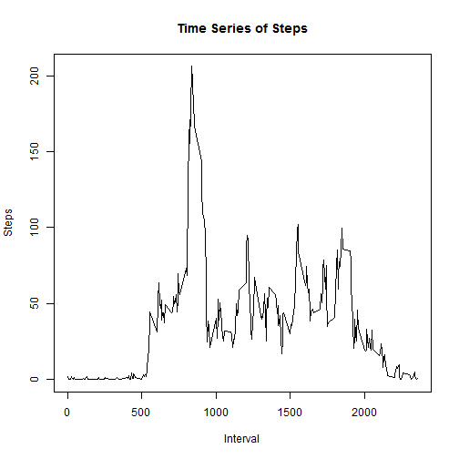

---
title: "Reproducible Research: Peer Assessment 1"
output: 
  html_document:
  keep_md: true
---

## Reading and loading the data 


```r
data <- read.csv(unz("activity.zip", "activity.csv"))
databydate <- aggregate(steps ~ date, data, sum, na.rm = TRUE)
databyslot <- aggregate(steps ~ interval, data, mean, na.rm = TRUE)
```


## What is mean total number of steps taken per day?


### Make a histogram of the total number of steps taken each day


```r
hist(databydate$steps, xlab = "Steps per Day", main = "Histogram of Steps")
```

 

### Calculate and report the mean and median total number of steps taken per day

The mean number of steps per day is 1.0766 &times; 10<sup>4</sup>

The median number of steps per day is 1.0765 &times; 10<sup>4</sup>


## What is the average daily activity pattern?

### Make a time series plot (i.e. type = "l") of the 5-minute interval (x-axis) and the average number of steps taken, averaged across all days (y-axis)


```r
plot (x=databyslot$interval, y=databyslot$steps, type = "l", xlab = "Interval", ylab = "Steps", main = "Time Series of Steps")
```

 

### Which 5-minute interval, on average across all the days in the dataset, contains the maximum number of steps?

The time interval with the max number of steps is 835

## Imputing missing values

### Calculate and report the total number of missing values in the dataset (i.e. the total number of rows with NAs)

The number of NA rows is 2304

### Devise a strategy for filling in all of the missing values in the dataset

The strategy I decide to use is mean for the interval

### Create a new dataset that is equal to the original dataset but with the missing data filled in


```r
library(plyr)
newdata <- ddply (data, "interval", function(df) {df$steps[is.na(df$steps)] <- mean(df$steps, na.rm=TRUE); return(df)})
```

### Make a histogram of the total number of steps taken each day and Calculate and report the mean and median total number of steps taken per day


```r
databydate <- aggregate(steps ~ date, newdata, sum, na.rm = TRUE)
hist(databydate$steps, xlab = "Steps per Day", main = "Histogram of Steps")
```

 

The mean number of steps per day after removing NAs is  1.0766 &times; 10<sup>4</sup>

The median number of steps per day  after removing NAs is  1.0766 &times; 10<sup>4</sup>

## Are there differences in activity patterns between weekdays and weekends

### Create a new factor variable in the dataset with two levels -- "weekday" and "weekend" indicating whether a given date is a weekday or weekend day


```r
data <- read.csv(unz("activity.zip", "activity.csv"))
data$date <- as.Date(data$date, "%Y-%m-%d")
data$wkdvwknd <- ifelse ( weekdays (data$date) %in% c ("Saturday", "Sunday"), "weekend", "weekday")
databyslotandwkday <- aggregate(steps ~ interval + wkdvwknd , data, mean, na.rm = TRUE)
```

### Make a panel plot containing a time series plot (i.e. type = "l") of the 5-minute interval (x-axis) and the average number of steps taken, averaged across all weekday days or weekend days (y-axis)


```r
library(ggplot2)
qplot(interval, steps, data = databyslotandwkday, facets = wkdvwknd ~ ., geom = "line")
```

 
